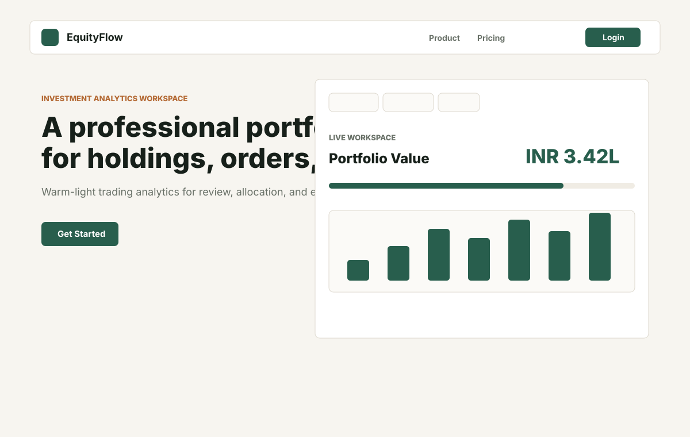
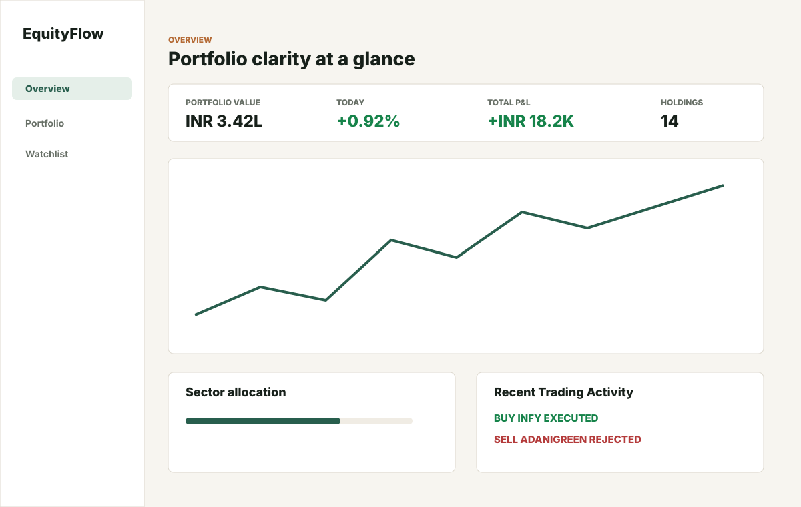
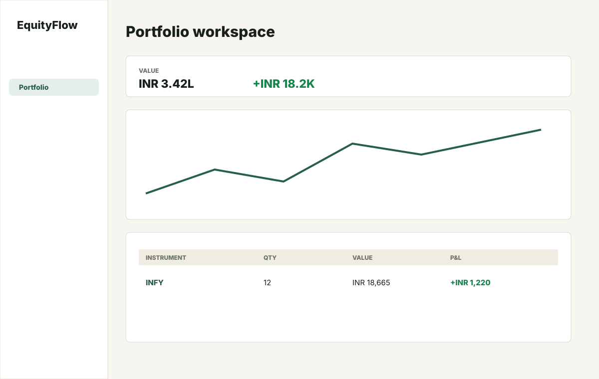
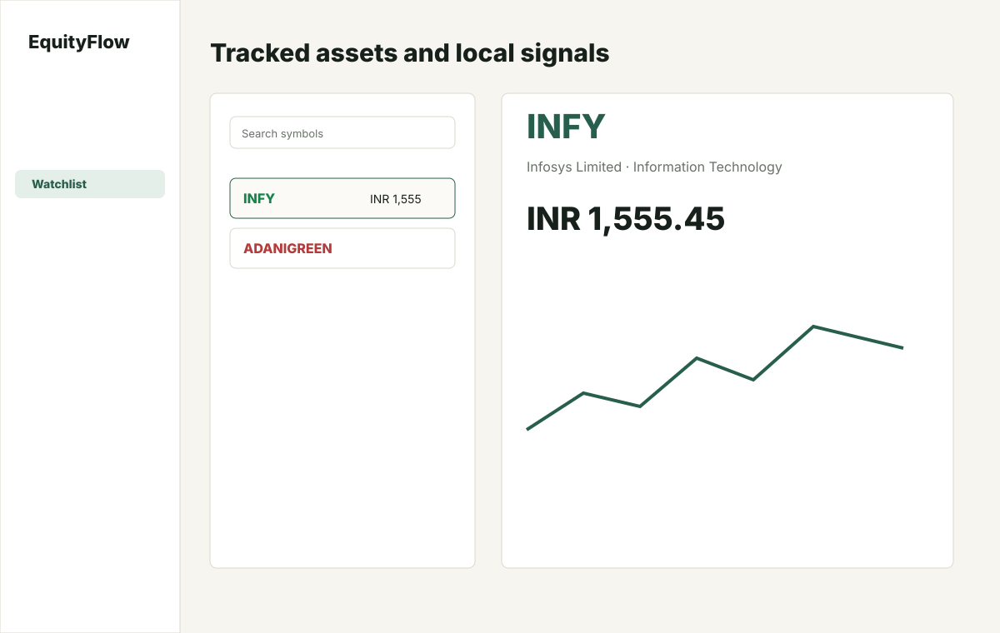
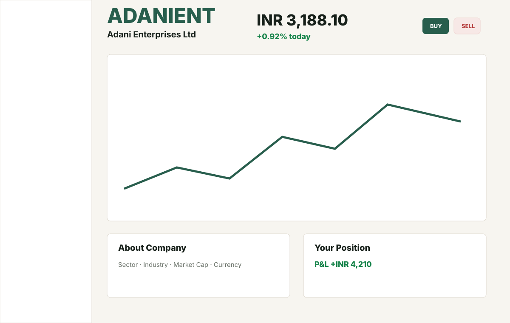
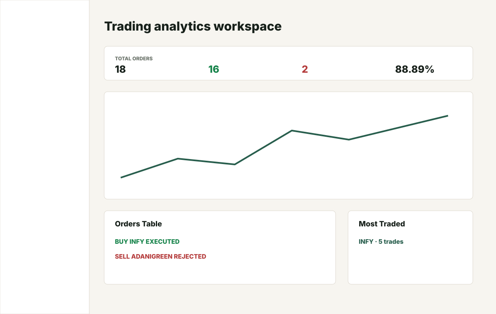
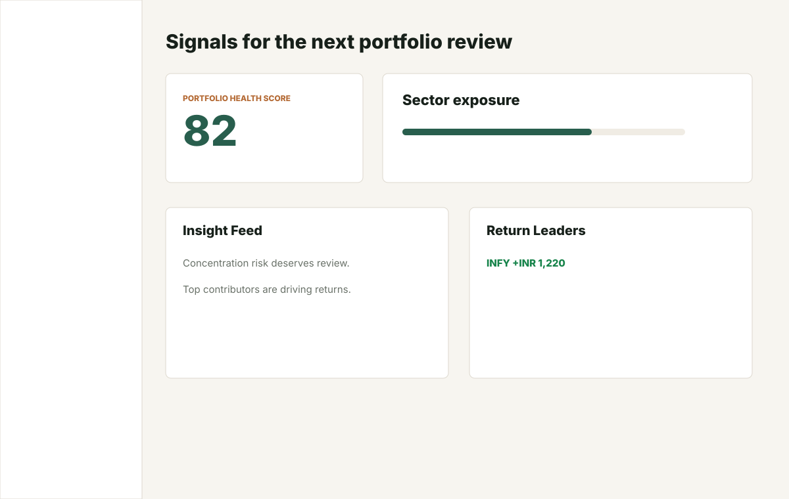
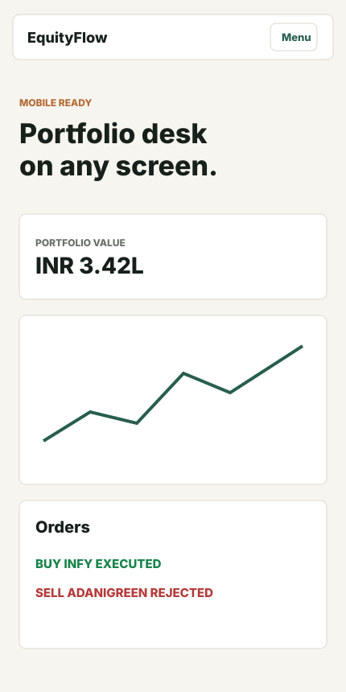

# EquityFlow

EquityFlow is a full-stack investment analytics platform with a warm-light
trading workspace for portfolio review, watchlists, stock details, order
history, and trading analytics.

The project has evolved from a broker-style dashboard into a cohesive fintech
product: public pages, authentication, portfolio analytics, stock metadata,
charts, and trading workflows now live inside a single React frontend backed by
an Express/MongoDB API.

## Screenshots

| Landing | Overview |
|---|---|
|  |  |

| Portfolio | Watchlist |
|---|---|
|  |  |

| Stock Detail | Orders |
|---|---|
|  |  |

| Insights | Mobile |
|---|---|
|  |  |

## Features

- JWT authentication with httpOnly cookie sessions.
- Protected dashboard routes for Overview, Portfolio, Watchlist, Insights,
  Settings, Orders, and Stock Detail pages.
- Portfolio Health Score, allocation analytics, sector exposure, and top movers.
- Holdings and Positions tabs inside the Portfolio workspace.
- Stock catalogue and price-history backed Watchlist and Stock Detail pages.
- Buy/Sell flow that creates immutable orders and updates holdings/positions.
- Orders analytics workspace with execution rate, order timeline, most traded
  symbols, and trading activity feed.
- Responsive warm-light public pages aligned with the logged-in dashboard style.

## Tech Stack

### Frontend

- React 18
- React Router
- Axios
- Recharts
- Material UI icons
- CSS with shared EquityFlow design tokens

### Backend

- Node.js
- Express
- MongoDB with Mongoose
- JWT
- bcryptjs
- cookie-parser
- CORS
- dotenv

## Project Structure

```text
EquityFlow/
├── backend/
│   ├── data/                 # Seed stock and price-history data
│   ├── middleware/           # Auth middleware
│   ├── model/                # Mongoose models
│   ├── routes/               # Auth, order, stock, analytics routes
│   ├── schemas/              # Mongoose schemas
│   ├── scripts/              # Seed and migration scripts
│   ├── services/             # Trading engine and analytics services
│   └── index.js              # Express app entry
├── docs/assets/screenshots/  # README screenshot assets
└── frontend/
    ├── public/
    └── src/
        ├── api/              # API clients
        ├── auth/             # AuthContext and route protection
        ├── charts/           # Recharts components
        ├── dashboard/        # Dashboard components and styles
        ├── landing_page/     # Public pages
        ├── layouts/          # Dashboard layout shell
        ├── pages/            # Auth and dashboard page wrappers
        └── utils/            # Formatters and analytics helpers
```

## Setup

### 1. Clone and install

```bash
git clone https://github.com/SujalP21/EquityFlow.git
cd EquityFlow
```

Install backend dependencies:

```bash
cd backend
npm install
```

Install frontend dependencies:

```bash
cd ../frontend
npm install
```

### 2. Backend environment

Create `backend/.env`:

```env
PORT=3002
MONGO_URL=your_mongodb_connection_string
CLIENT_URL=http://localhost:3000
JWT_SECRET=replace_with_a_long_secret
JWT_EXPIRES_IN=7d
COOKIE_EXPIRES_DAYS=7
```

### 3. Frontend environment

Create `frontend/.env` if your backend is not running on the default port:

```env
REACT_APP_API_URL=http://localhost:3002
```

### 4. Seed stock data

From `backend/`:

```bash
node scripts/seedStocks.js
node scripts/backfillSymbolsFromStocks.js
```

If you already have legacy records without user ownership, attach them to a
user by setting `USER_EMAIL` before running:

```bash
node scripts/attachUserIdToExistingData.js
```

### 5. Run locally

Start the backend:

```bash
cd backend
npm start
```

Start the frontend in another terminal:

```bash
cd frontend
npm start
```

Frontend runs on [http://localhost:3000](http://localhost:3000) by default.
Backend defaults to [http://localhost:3002](http://localhost:3002).

## Important Routes

### Public

- `/` - Landing page
- `/about` - Product mission and principles
- `/product` - Product modules
- `/pricing` - Plan overview
- `/support` - Support topics
- `/login` - Login
- `/register` and `/signup` - Register

### Dashboard

- `/overview` - Portfolio summary and recent trading activity
- `/portfolio` - Holdings, Positions, allocation, and performance
- `/watchlist` - Market watch and selected stock detail panel
- `/orders` - Orders and trading analytics
- `/insights` - Portfolio review prompts
- `/settings` - Account/settings workspace
- `/stock/:symbol` - Stock detail page

## API Highlights

- `POST /auth/register`
- `POST /auth/login`
- `POST /auth/logout`
- `GET /auth/me`
- `GET /allHoldings`
- `GET /allPositions`
- `POST /newOrder`
- `GET /orders`
- `GET /stocks`
- `GET /stocks/search?q=...`
- `GET /stocks/:symbol`
- `GET /stocks/:symbol/history?range=1M|3M|6M|1Y`
- `GET /analytics/overview`
- `GET /analytics/sector-exposure`
- `GET /analytics/allocation`
- `GET /analytics/top-movers`
- `GET /analytics/portfolio-performance?range=1M|3M|6M`

## Build

```bash
cd frontend
npm run build
```

## Notes

EquityFlow is a prototype and educational project. Seeded data and analytics
are illustrative and should not be treated as financial advice.
